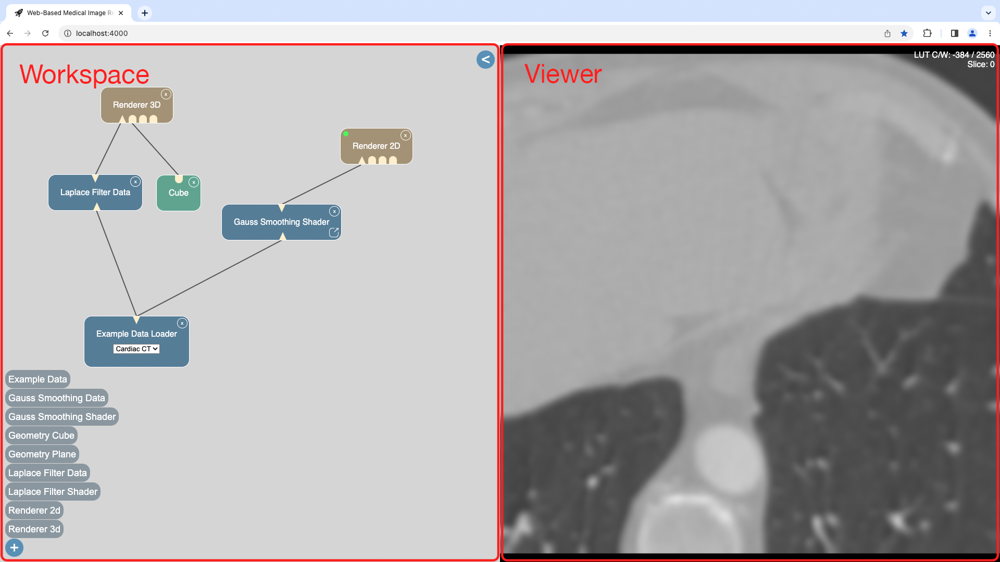

# Master Thesis: "Web-basierte Bildverarbeitung und Visualisierung"

## Getting started
**Check if half float is supported:**

https://registry.khronos.org/webgl/sdk/tests/conformance/extensions/oes-texture-half-float.html?webglVersion=1&quiet=0

If this fails, only 8-bit data can be displayed.

**Start application:**
1. Install [Node.js](https://nodejs.org/en/download)
2. Open project folder in an IDE (e.g. [Visual Studio Code](https://code.visualstudio.com/))
3. Run `npm install` in IDE terminal -> required packages are downloaded
4. Run `npm start` in IDE terminal -> application starts and is available on `http://localhost:4000/` in browser

## Create new module
To create a new module, a new TypeScript file has to be created and placed in the [modules](./src/modules/modules) folder. The file name is used in the "+" menu of the web application.

Declare the class with `export default class <ClassName> extends Module{}`.
`default` is needed to create the selected module. The new module extends the [`Module` class](./src/module/module.ts).

To create a new concrete module, the values are provided by inheritance with this class in the constructor:
- inputs: ModuleInOutPut 
    * -> number of Inputs
- outputs: ModuleInOutPut
    * -> number of Outputs
- moduleType: string
    * -> a CSS class to style the HTML of the module
- moduleName: string
    * -> module name, which will be displayed in the module
- dialog: IDialog
    * -> if necessary a dialog

Also the Methods have to be implemented:
- onUpdateImageDataInput() 
    * -> define what should happen when imageData input is updated.
         If the module has an output, the relevant output element should also be updated in this function (imageDataOutputs, sceneDataOutputs, baseObjectsOutputs)
         and then notifyOutputs() has to be called.
         Current input data are available in array imageDataInputs, sceneDataInputs, baseObjectInputs.
         No information which specific input was changed.
         Only the type, because the specific method onUpdateImageDataInput is called when an imageData input is updated.
- onUpdateSceneInput() 
    * -> same as for onUpdateImageDataInput()
- onUpdateBaseObjectInput() 
    * -> same as for onUpdateImageDataInput()
- onDialogSubmitCallback(value: any)
    * -> callback, which was passed to the created dialog. Specify what should happen on callback. Only necessary when a [dialog](./src/dialog) is used
- releaseInChild()
    * -> delete class variables
- setInnerModule()
    * -> customize html of the module. Use variable innerModule or if necessary html

## Description
[UML Class Diagram](./SoftwareArchi.pdf) of the webapplication.

Website for visualization of medical image data.

Used framework is Three.js.

## Usage
### Possible data types that can be imported with TypeScript:
- .png, .raw, .jpeg, .jpg, .svg, .glsl, .vs, .fs, .tif, .nrrd, .html
- to allow other data types update [file](./src/utils/used-data-types.d.ts) and [file](./webpack.config.js)

### Workspace
- Add module: Click the "+" button in the application and select the wanted module.

-  Connect modules: Click and hold the left mouse button on a module output icon. Then move the mouse to the matching module input symbol of another module.
     -> Modules are connected and line remains
- Terminate connection: Click with left mouse button on a input symbol
- Move workspace: ALT + right mouse button
- Zoom Workspace: scroll wheel
- Reset position: right mouse button

### 2D-Renderer
- Change Slice: scroll wheel
- Move camera: CTRL + right mouse button
- change LUT: right mouse button

### 3D-Renderer
- Zoom in/out: scroll wheel
- Rotate camera: left mouse button
- Move camera: CTRL + left mouse button
- change LUT: right mouse button

### Logging
- [Renderer](./src/renderer/renderer.ts): `showAndLogFpsEnabled = true`
- [Filter](./src/filter/filter-data-modify.ts): `isLoggingEnabled = true`

## License
This project is licensed under the MIT License - see the [LICENSE.md](./LICENSE) file for details

